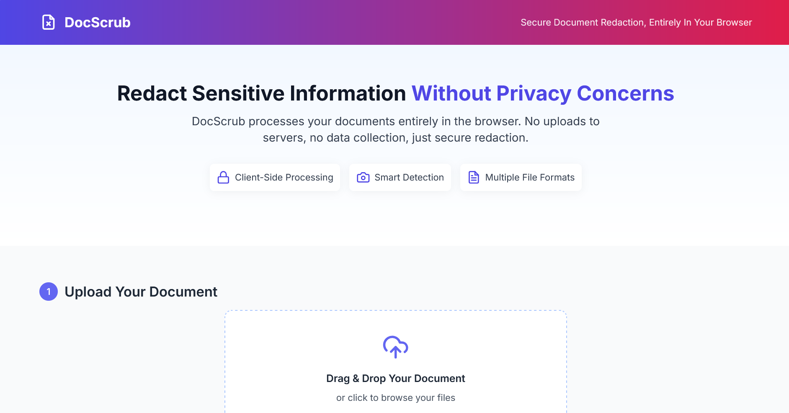

# DocScrub

A privacy-first document redaction tool that operates entirely in the browser. DocScrub lets you securely redact sensitive information from documents without uploading them to any server.



## 📱 Live Demo

You can access the live version of DocScrub on GitHub Pages:
[Live Github Page](https://dathtd119.github.io/DocSrcub)


## 🔒 Privacy Features

- **Client-side Processing**: All document parsing and redaction happens in your browser
- **No Server Uploads**: Your documents never leave your device
- **Zero Data Collection**: No tracking, no cookies, no analytics
- **Offline Capable**: Works without an internet connection once loaded

## ✨ Key Features

- **Intelligent Detection**: Automatically identifies potential sensitive information like names, emails, phone numbers, addresses, etc.
- **Multiple File Formats**: Supports PDF, DOCX, PPTX, XLSX, ODT, ODP, ODS, TXT, CSV, and more
- **Customizable Redaction**: Choose what to redact and how to redact it (asterisks, blackout, or custom replacement text)
- **Interactive Preview**: See the original and redacted versions side-by-side
- **Easy Download**: Get your redacted document with a single click

## 🚀 Tech Stack

- **[Astro.js](https://astro.build/)**: Framework for building fast, content-focused websites
- **[Tailwind CSS](https://tailwindcss.com/)**: Utility-first CSS framework
- **Document Processing Libraries**:
  - [officeparser](https://www.npmjs.com/package/officeparser): Multi-format document parser for docx, pptx, xlsx, odt, odp, ods, pdf
  - PDF.js: For parsing PDF files
  - Mammoth.js: For parsing DOCX files
  - SheetJS: For parsing Excel files
- **Modern JavaScript**: Leveraging the latest ES features
- **Docker**: For easy deployment and containerization

## 🛠️ Development

### Prerequisites

- Node.js 18+
- pnpm (recommended) or npm

### Setup

1. Clone the repository:
   ```bash
   git clone https://github.com/dathtd119/docscrub.git
   cd docscrub
   ```

2. Install dependencies:
   ```bash
   pnpm install
   ```

3. Start the development server:
   ```bash
   pnpm dev
   ```

4. Open [http://localhost:4321](http://localhost:4321) in your browser.

### Build

Build the project for production:

```bash
pnpm build
```

Preview the production build:

```bash
pnpm preview
```

## 🐳 Docker Deployment

### Using Pre-built Docker Image

The easiest way to run DocScrub is using our official Docker image from [DockerHub](https://hub.docker.com/r/dathtd119/docscrub):

```bash
docker pull dathtd119/docscrub:latest
docker run -p 8080:80 dathtd119/docscrub:latest
```

Access the application at [http://localhost:8080](http://localhost:8080)

### Using Docker Compose

You can quickly deploy DocScrub using Docker Compose with the following example:

1. Create a file named `docker-compose.yml` with the following content:

```yaml
version: '3.8'

services:
  docscrub:
    image: dathtd119/docscrub:latest
    container_name: docscrub-app
    ports:
      - "8080:80"
    restart: unless-stopped
    # If you need environment variables, add them here
    # environment:
    #   - NODE_ENV=production
```

2. Run Docker Compose:
   ```bash
   docker-compose up -d
   ```

3. Access the application at [http://localhost:8080](http://localhost:8080)

### Building Locally

If you prefer to build the Docker image yourself:

1. Clone the repository:
   ```bash
   git clone https://github.com/dathtd119/docscrub.git
   cd docscrub
   ```

2. Build the Docker image:
   ```bash
   docker build -t docscrub .
   ```

3. Run the container:
   ```bash
   docker run -p 8080:80 docscrub
   ```

## 📋 Development Guidelines

- **Branch Strategy**: Always make changes on the `plan_b` branch, then merge to `main`
- **Code Style**: Follow the project's ESLint and Prettier configuration
- **Commits**: Use descriptive commit messages explaining what changes were made and why
- **Documentation**: Update documentation when adding new features or making significant changes

## 📄 License

This project is licensed under the MIT License - see the [LICENSE](LICENSE) file for details.

## 🤝 Contributing

Contributions are welcome! Please feel free to submit a Pull Request.

1. Fork the project
2. Create your feature branch (`git checkout -b feature/amazing-feature`)
3. Commit your changes (`git commit -m 'Add some amazing feature'`)
4. Push to the branch (`git push origin feature/amazing-feature`)
5. Open a Pull Request

## 🔄 Recent Updates

- **GitHub Pages Available**: DocScrub is now accessible online via GitHub Pages
- **Automated Deployment**: Added GitHub Actions workflow for automatic deployment
- **DockerHub Available**: Official image now available on [DockerHub](https://hub.docker.com/r/dathtd119/docscrub)
- **Docker Support**: Added Dockerfile and docker-compose.yml for easy deployment
- **Enhanced File Format Support**: Added support for additional file formats like PPTX, ODT, ODP, and ODS using the officeparser library
- **Real Data Processing**: Replaced sample data with actual document processing and sensitive information detection
- **End-to-End Integration**: Integrated document parsing, analysis, and redaction engines
- **Improved Error Handling**: Added more robust error handling for document processing

## 🔮 Future Enhancements

- Enhanced detection of sensitive information through machine learning
- Support for batch processing multiple files
- Advanced redaction options (partial redaction, regex patterns, etc.)
- Improved accessibility features

## 🙏 Acknowledgments

- [officeparser](https://www.npmjs.com/package/officeparser) - A comprehensive library for parsing various office document formats
